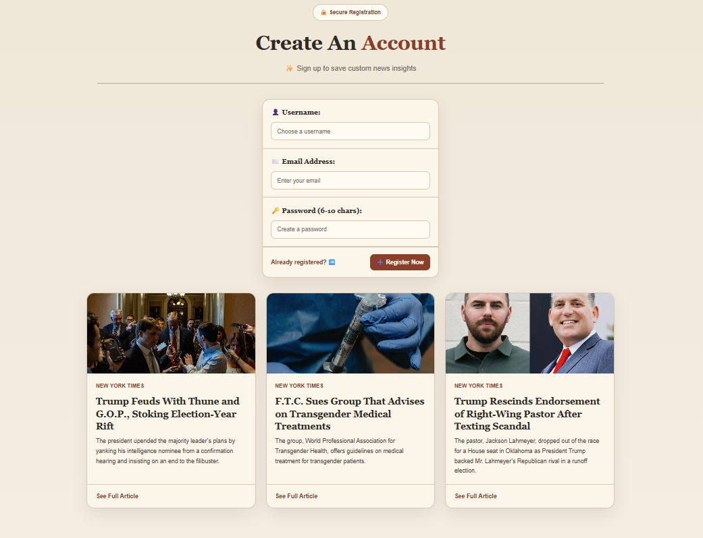
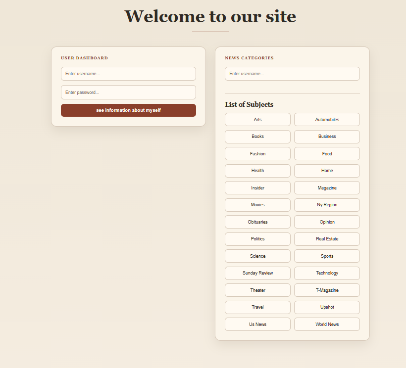
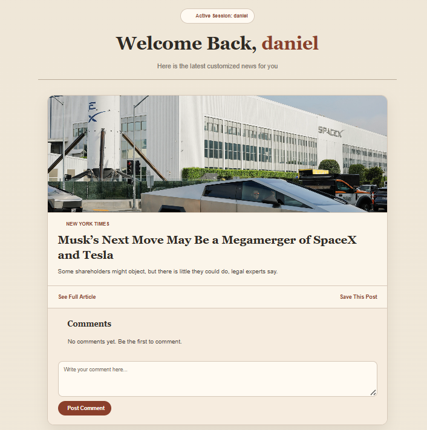
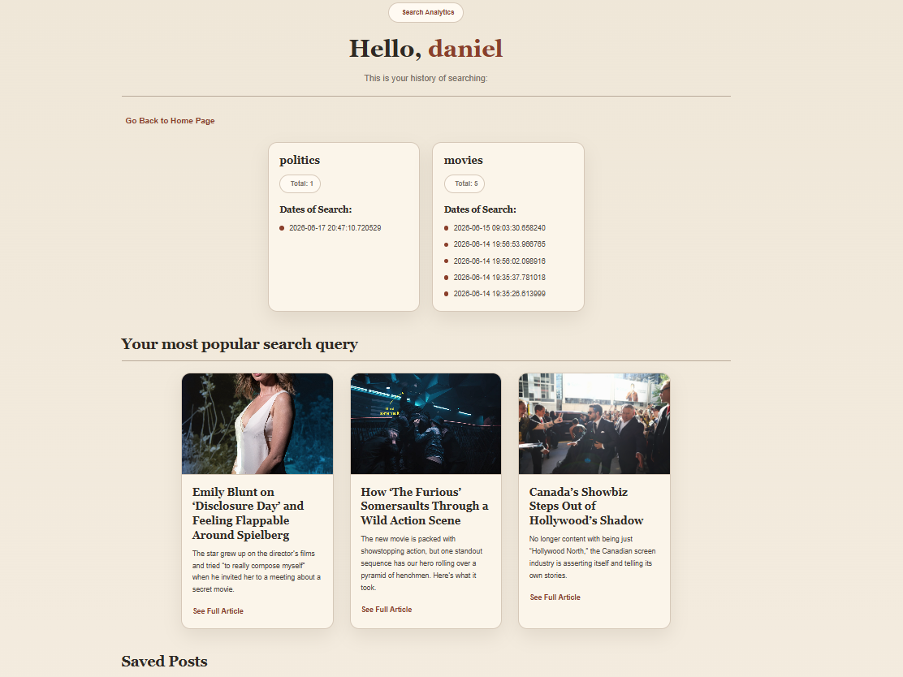
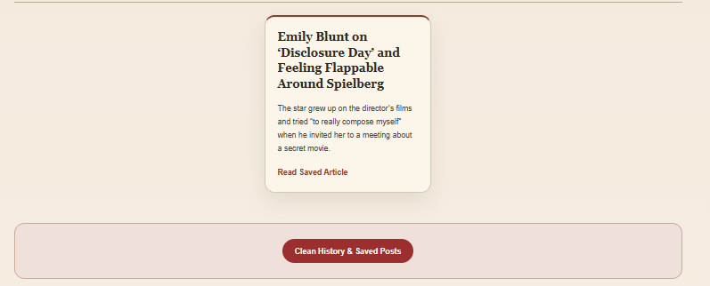
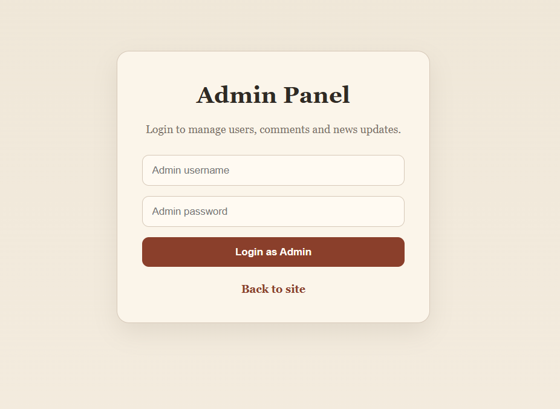
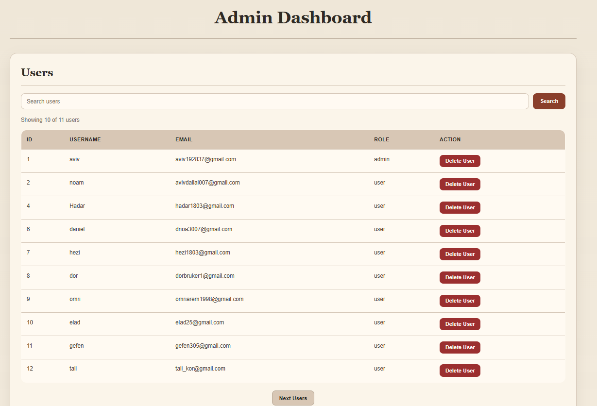
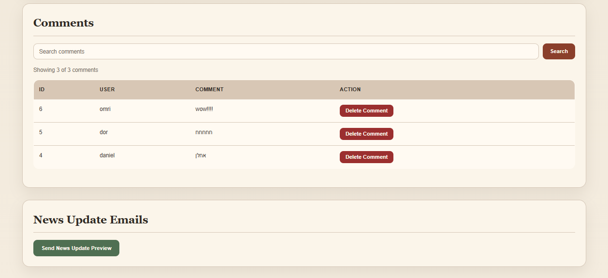

# Team WorkGit

[](https://github.com/326406501-svg/Team-WorkGit)
[](https://www.python.org/)
[](https://fastapi.tiangolo.com/)
[](#license)
[](#team-members)

FastAPI news web application with user registration, news search by category, user history, saved articles, comments, admin dashboard, and email notifications.

GitHub repository: https://github.com/326406501-svg/Team-WorkGit

## Screenshots

### Registration Page



### User Dashboard And News Categories



### News Search Page



### Favorites / History Page



### Saved Posts Page



### Admin Login Page



### Admin Dashboard



### Comments Management


## Tech Stack

- FastAPI
- PostgreSQL
- Jinja2
- HTML
- CSS
- JavaScript
- JWT
- New York Times API

## Team Members

| Team Member | Responsibilities |
| --- | --- |
| AvivDallal | Backend architecture, FastAPI routes, database integration |
| Guy Ron | User features, templates, frontend styling |
| 326406501-svg | GitHub repository, project integration, admin features |

## Installation Guide

### 1. Clone Repository

```powershell
git clone https://github.com/326406501-svg/Team-WorkGit.git
cd Team-WorkGit
```

### 2. Create Virtual Environment

```powershell
python -m venv .venv
.\.venv\Scripts\activate
```

### 3. Install Dependencies

```powershell
pip install -r requirements.txt
```

### 4. Database Setup

Install and run PostgreSQL, then create the project database:

```sql
CREATE DATABASE news_db;
```

The current local database connection is configured in `app/database.py`.

Create the project tables:

```powershell
python app/database.py
```

### 5. Run The Application

```powershell
uvicorn app.main:app --reload
```

Open the app:

```text
http://127.0.0.1:8000
```

Admin page:

```text
http://127.0.0.1:8000/admin
```

## API Endpoints

These are the main routes currently included by `app/main.py`.

| Method | Route | Purpose |
| --- | --- | --- |
| `GET` | `/` | Registration home page with news preview |
| `POST` | `/register` | Register a new user |
| `GET` | `/login` | Show login page |
| `POST` | `/data` | Show user history, saved posts, and recommended posts |
| `POST` | `/data_save` | Save an article to favorites |
| `POST` | `/cleanhistory` | Clear user history and saved articles |
| `POST` | `/search_user` | Search news by username and category |
| `POST` | `/search_user_more` | Load more articles for the same category |
| `POST` | `/add_comment` | Add a comment to an article |
| `GET` | `/admin` | Show admin login page |
| `POST` | `/admin/dashboard` | Open admin dashboard after login |
| `POST` | `/admin/dashboard/filter` | Filter and paginate admin dashboard data |
| `POST` | `/admin/delete_user` | Delete a regular user |
| `POST` | `/admin/delete_comment` | Delete a comment |
| `POST` | `/admin/send_news_update` | Send a news update email preview |

## Requirements File

Dependencies are stored in `requirements.txt`.

Install them with:

```powershell
pip install -r requirements.txt
```

## Future Improvements

- Improved authentication with hashed passwords.
- Move API keys, database passwords, email passwords, and JWT secrets to environment variables.
- Advanced news filtering by source, date, and keyword.
- Cloud deployment with a production PostgreSQL database.
- Better mobile responsiveness.
- Add automated tests.
- Add user profile editing.
- Add role-based admin permissions.

## Project Structure

```text
team-workgit/
|
|-- app/
|   |-- __init__.py
|   |-- main.py
|   |-- database.py
|   |-- models.py
|   |
|   |-- routers/
|   |   |-- __init__.py
|   |   |-- admin.py
|   |   |-- users.py
|   |   |-- intersects.py
|   |   |-- Eshow_users_search.py
|   |   |-- comments.py
|   |   |-- favorites.py
|   |   `-- interests.py
|   |
|   |-- services/
|   |   |-- __init__.py
|   |   |-- news_service.py
|   |   |-- message.py
|   |   `-- auth_service.py
|   |
|   |-- templates/
|   |   |-- admin_dashboard.html
|   |   |-- admin_login.html
|   |   |-- register.html
|   |   |-- status.html
|   |   |-- index.html
|   |   |-- Euser_search.html
|   |   `-- user_history.html
|   |
|   `-- static/
|       |-- css/
|       `-- js/
|
|-- .gitignore
|-- README.md
|-- requirements.txt
`-- users.py
```

## Deployment Notes

For production deployment:

1. Use a production PostgreSQL database.
2. Store secrets in environment variables.
3. Install dependencies with `pip install -r requirements.txt`.
4. Run the app with Uvicorn or Gunicorn.
5. Use Nginx as a reverse proxy if deploying to a Linux server.

Example production command:

```bash
uvicorn app.main:app --host 0.0.0.0 --port 8000
```

## License

School project. Add a formal license file if this project becomes public production software.
